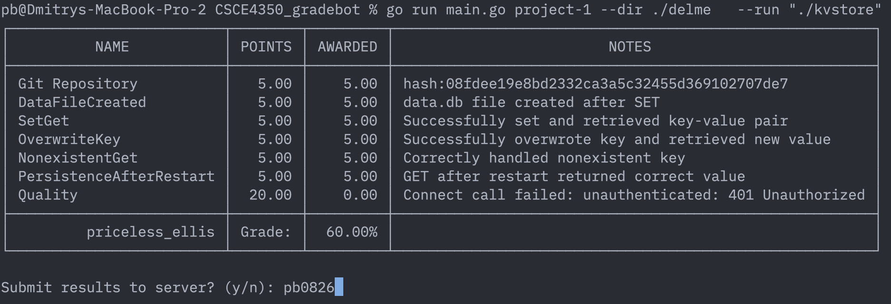
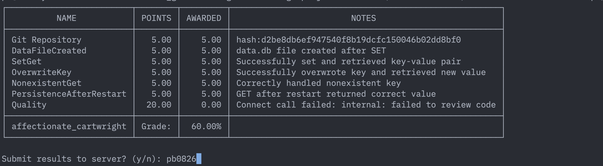

# Key-Value Store

A persistent key-value store written in C++ using an append-only log for storage.
Supports `SET`, `GET`, and `EXIT` commands via stdin/stdout.

---

## Requirements

- macOS (tested on macOS 15)
- Apple Clang 17+ (`clang++ --version` to check)
- C++17 or later

---

## Compile

```bash
make
```

Or manually:

```bash
clang++ -std=c++17 -Wall -Wextra -O2 -o kvstore main.cpp
```

To clean build artifacts:

```bash
make clean
```

---

## Run

```bash
./kvstore
```

Then type commands interactively:

```
SET name Alice
OK
GET name
Alice
GET missing
NULL
EXIT
```

---

## Commands

| Command | Description | Response |
|---|---|---|
| `SET <key> <value>` | Store a key-value pair | `OK` |
| `GET <key>` | Retrieve value by key | value or `NULL` |
| `EXIT` | Quit the program | — |

---

## Pipe commands (non-interactive)

```bash
printf "SET name Alice\nGET name\nEXIT\n" | ./kvstore
```

Or from a file:

```bash
./kvstore < commands.txt
```

---

## How It Works

### Append-Only Log (`data.db`)
Every `SET` command is immediately written to `data.db` next to the executable:
```
SET name Alice
SET color blue
```
The file is never overwritten — only appended to — so data survives crashes and restarts.

### Startup Replay
On launch, the program reads `data.db` line by line and replays every `SET` into memory. The last value for any key wins (last-write-wins semantics).

### In-Memory Index
A custom singly linked list stores all key-value pairs in memory for fast reads during a session. No `std::map` or `std::unordered_map` is used.

---

## Project Structure

```
kvstore/
├── main.cpp                 # Full implementation
├── Makefile                 # Build config
├── data.db                  # Auto-created on first SET
└── gradebot_screenshot.png  # Gradebot results
```

## Gradebot Results
First attempt:

After setup gradebot server:(openAI key require payment)

